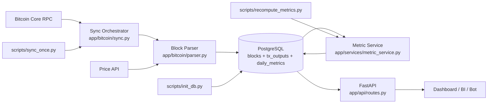

# Onchain Parser — System Schematic (Builder View)

This document explains the `onchain_parser/` project in one page.

## 1) What was built

A Python-first backend skeleton that:

1. Reads Bitcoin blocks from Bitcoin Core RPC.
2. Normalizes transaction outputs into a Postgres schema.
3. Tracks when outputs are later spent.
4. Computes daily on-chain metrics (Realized Cap, MVRV, NUPL, SOPR, CDD).
5. Exposes lightweight API endpoints for dashboard consumption.

---

## 2) Architecture schematic



---

## 3) Data model schematic

```text
blocks
- height (PK)
- hash
- timestamp

tx_outputs
- txid + vout (composite PK)
- block_height (FK -> blocks.height)
- value_sats
- created_at
- created_price_usd
- spent_in_txid (nullable)
- spent_at (nullable)
- spent_price_usd (nullable)

daily_metrics
- day (PK)
- realized_cap_usd
- market_cap_usd
- mvrv
- nupl
- sopr
- cdd
```

---

## 4) Operational flow

1. **Init DB** → create schema.
2. **Sync blocks** → parse blocks in order, persist outputs, mark spends.
3. **Compute daily metrics** → aggregate from normalized tables.
4. **Serve API** → dashboard pulls `/metrics/daily`.

---

## 5) Why this is a good MVP

- Correctness-first architecture (easy to reason about).
- Clean separation: parser vs metric engine vs API.
- Easy path to Phase 2 optimizations:
  - chunk tuning,
  - better indexing,
  - caching,
  - daily incremental updates.
